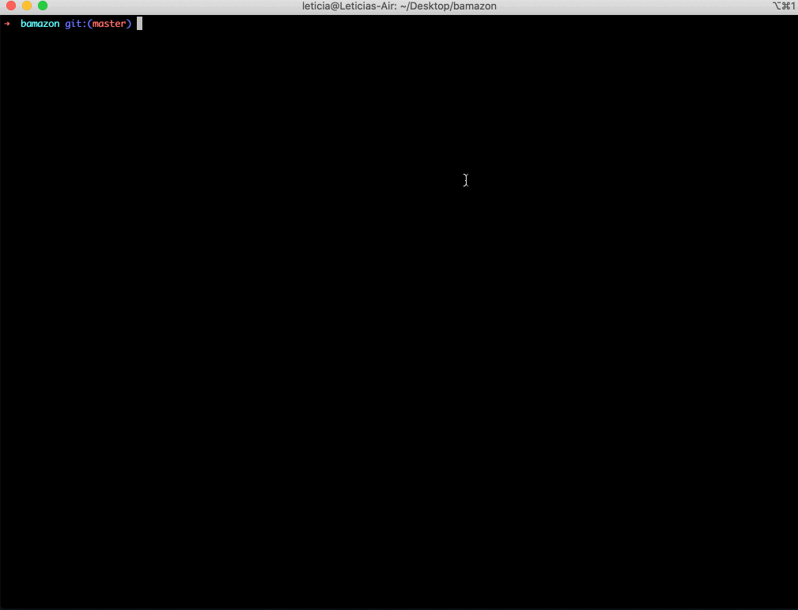
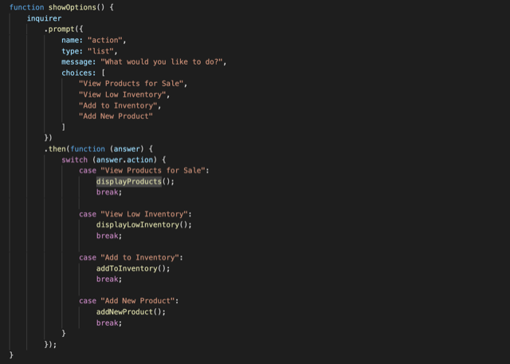
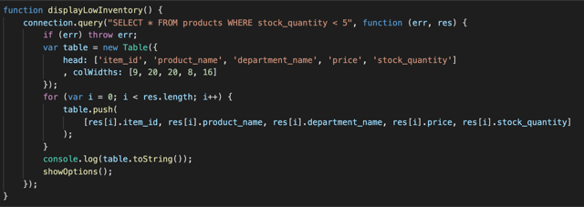
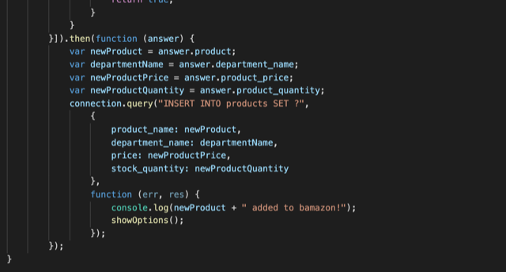

# Bamazon

This is an Amazon-like storefront node app that takes in orders from customers and depletes stock from the store's inventory. The "Manager View" lets you check for low inventory, add more items to the existing inventory, and add new products entirely.

## Technologies used

* MySQL & MySQL Workbench
* Node.js & JavaScript
* Node packages:
  * Inquirer
  * [cli-table](https://www.npmjs.com/package/cli-table) (to create pretty unicode tables for the CLI)
  * DotEnv
  * MySQL

## User Flow GIFs

The **Customer View** lets you view all the items available for sale, and asks you for the ID of the product and the number of units you would like to buy, so you can place an order. The app checks if the product is in stock, fulfills the customer's order, and updates the SQL database to reflect the remaining stock.

The **Manager View** gives you the following choices: view a list of all available items, view all items with an inventory count lower than five, and option to add more of any item currently in stock, and an option to add new products to the store. The database gets updated accordingly.

## Essential Code

Code to display a menu in the 'Manager View' and execute the appropriate function based on the selection:

Code to perform a database query to display products that are low in inventory:

Code to update the database, adding a new product based on user input:

## Links
[My LinkedIn](https://www.linkedin.com/in/leticiaroncero/?locale=en_US)

[Professional Portfolio](https://leticiaroncero.github.io/Responsive-Portfolio/portfolio.html)